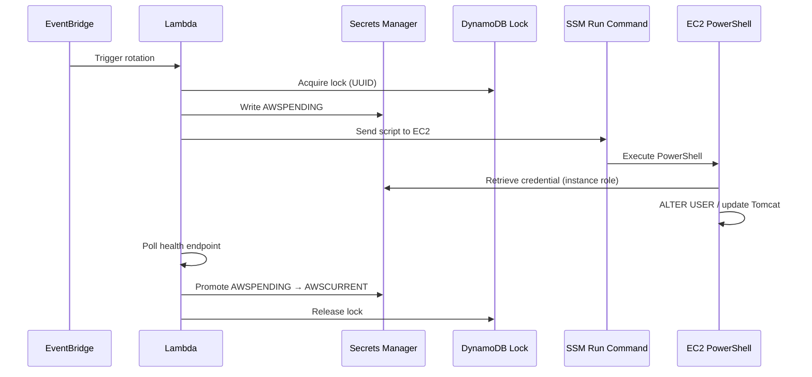

Most credential rotation guides stop at the AWS console. This one starts where the
real work begins: getting a Lambda function to reach into a Windows EC2 instance,
change an Oracle password, update a Tomcat properties file, and prove the whole
thing worked — without ever putting a plaintext password in a log.

## The Problem

Six Oracle accounts. Three secret types. One EC2 instance running both Oracle XE
and Tomcat. AWS Secrets Manager has a four-step rotation lifecycle
(`createSecret`, `setSecret`, `testSecret`, `finishSecret`) but no built-in
support for Oracle on Windows. You have to build the rotation Lambda yourself.

The harder constraint: the credential change has to be atomic from the
application's perspective. Tomcat reads passwords from `application.properties`
at startup. If Oracle gets a new password before Tomcat does, every connection
attempt fails until Tomcat restarts with the new value. The rotation sequence
has to be: change Oracle → update properties file → restart Tomcat → verify
connection — all or nothing.

## The Architecture

Lambda owns the AWS side of the lifecycle. PowerShell owns the EC2 instance.
SSM Run Command is the bridge.

When rotation fires:
1. Lambda writes `AWSPENDING` to Secrets Manager
2. Lambda sends a PowerShell script to EC2 via SSM Run Command
3. PowerShell (running as SYSTEM on EC2) retrieves the new credential from
   Secrets Manager using the instance role — no password in the script string
4. PowerShell runs `ALTER USER` against Oracle XEPDB1, updates the properties
   file, and restarts Tomcat
5. Lambda polls the Tomcat health endpoint and tests the Oracle connection
6. On success, Lambda promotes `AWSPENDING` to `AWSCURRENT`
7. On any failure, Lambda rolls back to `AWSCURRENT` and releases the lock

## The Lock Problem

Secrets Manager has no native concurrency control. If two Lambda invocations
fire for the same secret at the same time — which EventBridge will happily do
on a short interval — both will try to run `ALTER USER` simultaneously. The
second one will fail because the password it read from `AWSCURRENT` is already
stale.

The solution is a DynamoDB lock table with a TTL. Each invocation writes a lock
record with a `lockOwner` UUID before touching anything. The `FINALLY` block
releases it — only if the UUID matches. That last part matters: without the
ownership check, a slow invocation could release a lock it didn't acquire.

## What I Learned

The `lockOwner` token design came from an observed failure. During testing, a
local script and a Lambda invocation fired concurrently. The Lambda's lock only
guards Lambda-vs-Lambda concurrency — it has no visibility into code running
outside the rotation lifecycle. One SSM command failed. The rollback path ran
correctly and the system recovered without manual intervention, but it exposed
the gap: **the lock is not a substitute for disabling scheduled triggers before
running manual scripts.**

The other lesson: don't put passwords in SSM command strings. They show up in
CloudTrail and SSM command history in plaintext. The fix is to pass the secret
ARN and have the EC2-side script retrieve the credential itself using the
instance role. That way nothing sensitive travels over the SSM channel.

## Links

- [GitHub Repository](https://github.com/scottyleblanc/OracleAwsRotation)
