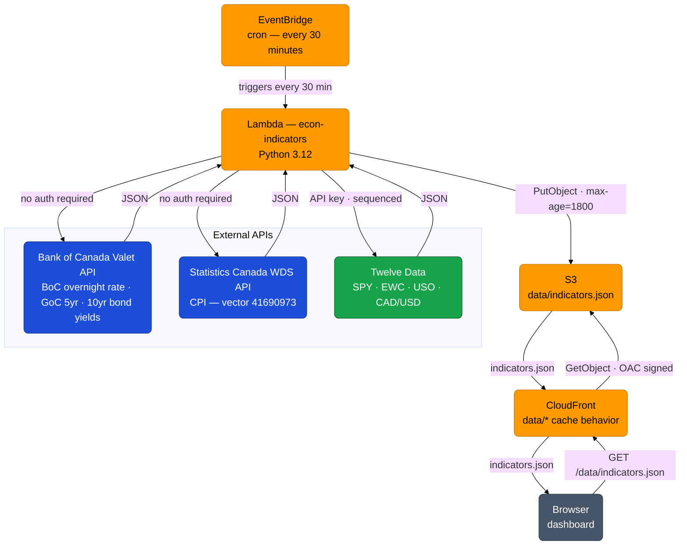

### The Browser Gets Out of the Business of Fetching Data

*This is the third post in a series documenting the build-out of a Canadian economic indicators dashboard. [Stage 1](/posts/econ-stage-1-post/) covered the original problem and what was built. [Stage 2](/posts/econ-stage-2-post/) moved the dashboard into the Hugo site.*

---

Stage 2 ended with a working dashboard on tacedata.ca — but the four constraints from Stage 1 were still in place. Every visitor needed their own Twelve Data API key. Every refresh took 32 seconds. A 90-second cooldown enforced rate limit compliance. The TSX and crude oil cards used ETF proxies because direct sources were blocked by CORS.

Stage 3 eliminates all of them by moving data fetching out of the browser entirely.

---

### The architecture shift

The browser-side design had a fundamental problem: it placed every upstream API call on the visitor's device, using the visitor's network, subject to CORS restrictions and per-device rate limits.

The alternative is straightforward: a Lambda function runs on a schedule, fetches all eight indicators server-to-server, and writes the results to S3 as a single JSON file. The dashboard fetches that file on load — one request, no API key, no rate limits, no CORS. Data is never more than 30 minutes stale.



The signal computation, rendering logic, and all card HTML stay exactly where they are. The dashboard stops being a data fetcher and becomes a pure display layer.

---

### What the Lambda writes

The Lambda produces a single JSON file. The schema was designed to match exactly what each card consumes — no transformation needed in the browser:

```json
{
  "generated_at": "2026-04-05T14:00:00Z",
  "boc": {
    "cur": 2.75,
    "prev": 3.00,
    "date": "2026-03-12"
  },
  "bonds": {
    "b5":  { "cur": 3.12, "prev": 3.09, "history": [...30 values...], "date": "2026-04-04", "stale": false },
    "b10": { "cur": 3.28, "prev": 3.25, "history": [...30 values...], "date": "2026-04-04", "stale": false }
  },
  "cpi": {
    "yoy": 2.3,
    "mom": 0.1,
    "yoy_history": [...13 values...],
    "ref_date": "2026-02"
  },
  "sp":  { "cur": 548.21, "prev": 541.10, "history": [...30 values...] },
  "tsx": { "cur": 43.18,  "prev": 42.95,  "history": [...30 values...] },
  "oil": { "cur": 18.42,  "prev": 18.10,  "history": [...30 values...] },
  "cad": { "cur": 0.7312, "prev": 0.7298, "history": [...30 values...] }
}
```

A few design decisions worth noting:

**`bonds` is a nested object.** The Bank of Canada returns both yield series in a single API call. Grouping them in the JSON reflects that — the Lambda makes one request, the JSON has one `bonds` key.

**`stale` is pre-computed by the Lambda.** The dashboard previously computed the stale flag from the bond yield date at render time. The Lambda does this once at fetch time and writes the boolean to the JSON. The dashboard just reads it.

**`generated_at` drives the timestamp.** The dashboard previously showed when the browser last refreshed. It now shows when the Lambda last ran — a more meaningful timestamp for a cached data feed.

**The JSON lives at `/data/indicators.json`** in the existing S3 bucket, served through CloudFront. The CloudFront cache TTL on that path is set short enough that visitors always get data from the most recent Lambda run.

---

### What disappeared from the dashboard

The following were removed from the dashboard HTML entirely:

- API key overlay and localStorage key management
- `tdFetch`, `tdQuote`, `tdSeries` — all Twelve Data fetch logic
- `loadBoC`, `loadBonds`, `loadCPI` — all government API fetch logic
- `loadEquity`, `loadSP`, `loadTSX`, `loadOil`, `loadCAD` — all card loaders
- `loadAll` — the orchestration function sequencing all eight calls
- The 8-second pauses between Twelve Data symbols
- The 90-second cooldown and its timer
- The diagnostics panel (existed solely to test Twelve Data symbol availability)

Replaced by a single fetch on load, a JSON parse, and a call into the existing rendering functions.

---

### Error handling

When the JSON fetch fails — Lambda hasn't run, S3 is unavailable, network error — the failure is surfaced prominently. No quiet "Unavailable" labels on individual cards. A banner-level error state makes it clear the data feed is down, when it last succeeded, and that the signal readings below are stale or absent. The principle: don't hide failures, make them front and center.

---

### What didn't change

Every line of signal computation is identical to v0.3.0. The thresholds, the signal text, the verdict logic, the sparkline colour conventions — untouched. The observation log is unaffected. The card HTML and CSS are unchanged.

The dashboard looks and behaves identically to Stage 2 from the visitor's perspective, with two visible differences: no API key prompt on first load, and a `generated_at` timestamp instead of a browser refresh timestamp.

---

### What comes next

With CORS no longer a constraint, Stage 4 evaluates replacing the ETF proxies with direct data sources — TSX Composite directly, WTI crude directly, and potentially a more robust bond yield feed. The data source choices that were forced by browser limitations are now open questions again.

---

*This dashboard is an informational tool for personal use. It is not financial advice. Mortgage decisions depend on personal circumstances that no dashboard can capture. Consult a mortgage broker or financial advisor before making rate decisions.*
