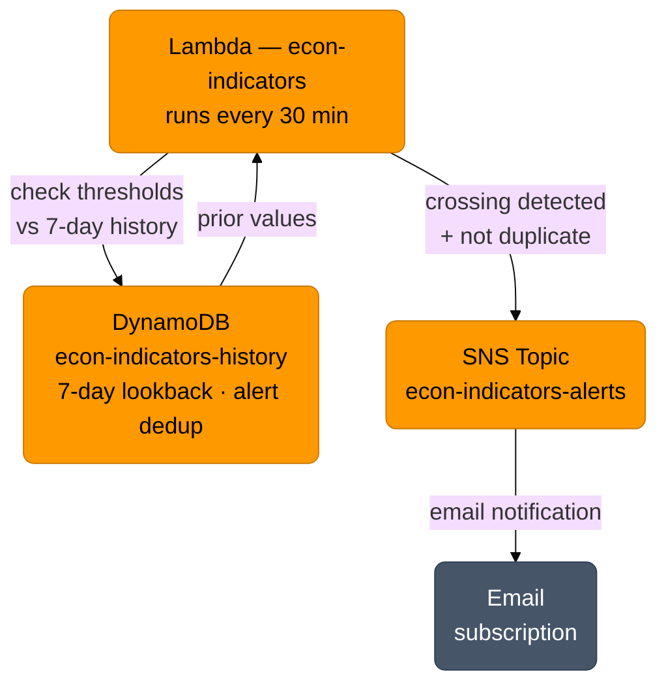

### The Dashboard Shouldn't Require Checking

*This is the sixth post in a series documenting the build-out of a Canadian economic indicators dashboard. [Stage 1](/posts/econ-stage-1-post/) covered the original problem. [Stage 2](/posts/econ-stage-2-post/) moved the dashboard into the Hugo site. [Stage 3](/posts/econ-stage-3-post/) moved all data fetching into AWS Lambda. [Stage 4](/posts/econ-stage-4-post/) replaced ETF proxies with direct data sources. [Stage 5](/posts/econ-stage-5-post/) added DynamoDB historical storage and 3M/6M sparklines.*

---

The dashboard is useful. But it requires going to look at it. For a mortgage rate decision tool, most of the time nothing significant is happening — the indicators are stable, the signals are neutral, and checking in adds no value.

Stage 6 inverts that. Instead of pulling data on demand, the Lambda pushes a notification when something worth knowing about happens.

---

### What Triggers an Alert

Not every movement is worth an alert. The triggers are limited to crossings with a direct relationship to mortgage rate decisions:

| Indicator | Trigger | Why it matters |
|---|---|---|
| GoC 5yr yield | Up > +0.30% over 7 days | Fixed mortgage rates follow within weeks |
| GoC 10yr yield | Curve inverts (10yr < 5yr) | Recession signal; rate cuts likely ahead |
| CPI YoY | Crosses above 3.0% | BoC mandate breach — limits room to cut |
| CPI YoY | Crosses below 2.0% | Inflation cooling — room for cuts opening |
| BoC rate | Any change (up or down) | Direct impact on variable rate payments |
| S&P 500 | Down > 10% over 7 days | Recession signals; BoC rate cuts may follow |

"Crosses" is the operative word. An alert fires when the current value moves from one side of a threshold to the other — not simply when it is above or below. A CPI reading that has been at 3.2% for six weeks does not keep sending alerts. The alert fires once on the crossing, then again only if it dips back below and rises above again.

---

### Deduplication

The crossing logic prevents repeated alerts for persistent conditions, but a 30-minute Lambda schedule means the same crossing could theoretically fire twice in a row if two runs straddle the same event.

Each alert sent is recorded in DynamoDB (`pk = "ALERT"`, `ts = trigger_name`, with a 24-hour TTL). Before sending, the Lambda checks whether the same trigger fired within the last 24 hours. If yes, it suppresses the duplicate.

This uses the same `econ-indicators-history` table — no new AWS resource needed.

---

### Architecture

One new AWS resource: an SNS topic with a single email subscription.



The Lambda already has DynamoDB read access from Stage 5. The only new permission is `sns:Publish` on the alerts topic.

---

### Alert Format

Each email identifies the indicator, what crossed, what direction, and links to the dashboard:

```
Subject: [econ-alert] GoC 5yr yield up +0.42% over 7 days

GoC 5yr Bond Yield has risen +0.42% over the past 7 days.
Current: 3.35%  |  7 days ago: 2.93%

Fixed mortgage rates typically follow within 2-4 weeks.
This may be a good time to review your rate decision.

Dashboard: https://tacedata.ca/projects/econ/interest-rate/

---
This is an automated alert from the tacedata.ca economic indicators dashboard.
Not financial advice.
```

---

### AWS Infrastructure Required

1. **SNS topic** — `econ-indicators-alerts`, standard type
2. **Email subscription** — confirmed via the AWS confirmation email
3. **Lambda execution role** — add `sns:Publish` scoped to the topic ARN
4. **Lambda env var** — `SNS_TOPIC_ARN`

---

### What Comes Next

Stage 6 completes the core feature set of the dashboard as originally conceived. Future work would be refinements — adjusting thresholds based on how the alerts perform in practice, adding additional indicators, or expanding the alert delivery options.

---

*This dashboard is an informational tool for personal use. It is not financial advice. Mortgage decisions depend on personal circumstances that no dashboard can capture. Consult a mortgage broker or financial advisor before making rate decisions.*
