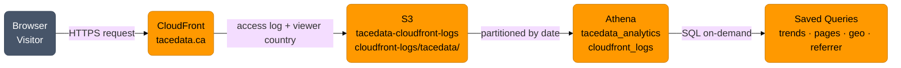

## Problem

Once the site was live, there was no way to answer basic questions about how it was being used. Is anyone visiting? Which pages are people looking at? Is the LinkedIn profile link driving any traffic? Where are visitors coming from geographically?

The standard answer is Google Analytics or a similar third-party tool. That answer comes with a JavaScript snippet on every page, a cookie consent banner, and visitor data handed to a third party. For a site that needs none of that complexity, it is the wrong trade.

## Intended Solution

CloudFront already knows everything about every request it serves — date, time, URL, status code, referrer, and with minimal configuration the visitor's country. Those logs land in S3. Athena can query S3 directly without moving the data anywhere.

The intended result: a fully AWS-native analytics pipeline with no client-side JavaScript, no cookies, no third-party services, and near-zero incremental cost.

## What Was Built

The S3 log bucket was configured correctly. The rest was blocked before it could be used.

**Key finding — Object Ownership:** CloudFront standard logging uses ACL-based log delivery. The destination S3 bucket must use `BucketOwnerPreferred` object ownership. `BucketOwnerEnforced` disables ACLs and causes CloudFront to reject the logging configuration.

## Where It Stopped

CloudFront's **Free pricing plan** blocks all logging features. Attempting to enable standard logging returned:

> `Distributions with the Free pricing plan can't have the following features: Standard logging`

The Free plan ($0/month) bundles DDoS protection, managed WAF rules, CDN, and edge compute — but no logging. Logging requires the **Pro plan at $15/month**.

The distribution has an auto-created WAF WebACL that was investigated as an alternative: WAF inspects every request and can log to S3. That path hit the same restriction — WAF logging also requires Pro.

## Intended Architecture

## Privacy Design

The intended setup would have collected only the minimum fields needed:

| Goal | Fields |
|---|---|
| Traffic trends | `date`, `time` |
| Geographic distribution | viewer country (ISO 3166 alpha-2) |
| Page visit tracking | `cs-uri-stem`, `sc-status` |
| Traffic source | `cs-referer` |

Excluded: IP addresses, user agent strings, query strings, bytes transferred, cache status.

## Status

Closed 2026-05-07. The design is sound — if the distribution is upgraded to the Pro plan, the implementation picks up from Step 2 (enable CloudFront logging) with the architecture unchanged.

## Build Series

- [Stage 1 — What the Free Plan Doesn't Tell You](/posts/analytics-stage-1-post/) — S3 bucket configuration, the Free plan logging restriction, WAF logging as a blocked alternative, and the decision not to upgrade
