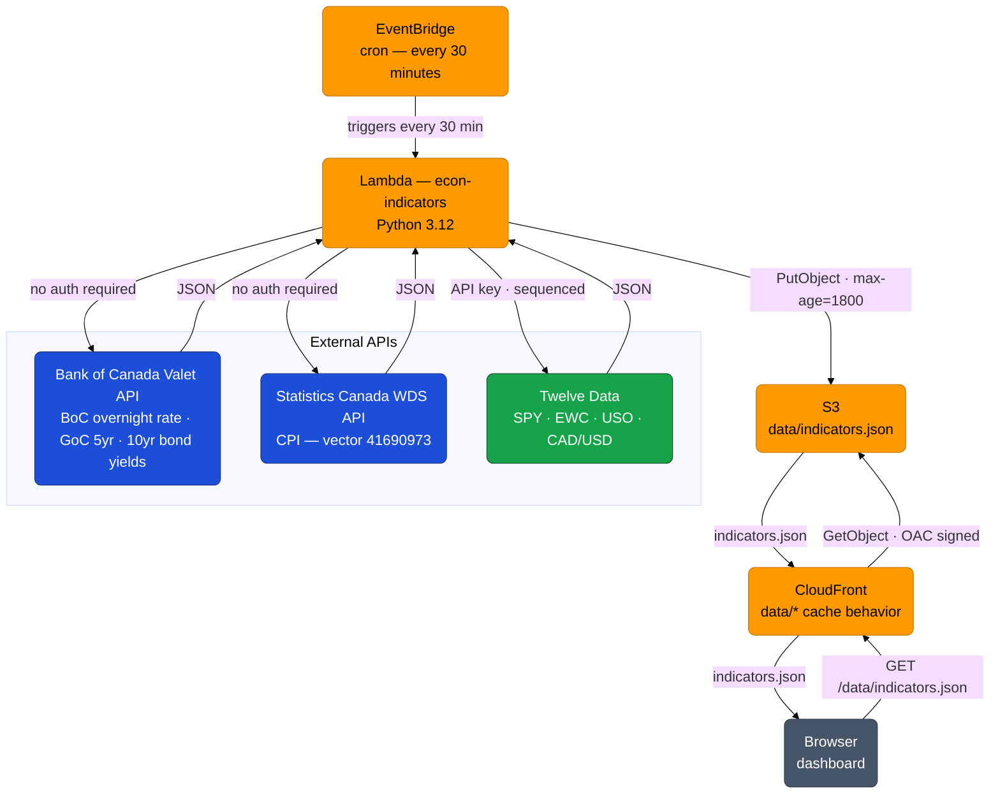

## Problem

When facing a mortgage renewal, the question of whether to lock in a fixed rate or stay variable is genuinely difficult. The internet has no shortage of opinion. What it lacks is a clean, signal-based view of the indicators that actually matter — stripped of media noise, translated into plain English, and specific to the Canadian context.

What I wanted was a small number of reliable signals, updated regularly, that I could check once a week and form a view from.

## What It Does

Eight economic indicators with a documented relationship to Canadian mortgage rates. Each measures the same underlying question from a different angle: how confident are businesses, consumers, and investors in the future?

**Market and price indicators** — move daily, reflect real-time confidence:

| Indicator | Proxy | What it signals |
|---|---|---|
| S&P 500 | SPY ETF | Broad economic confidence; sustained declines push central banks toward cuts |
| TSX Composite | EWC ETF | Canadian equity market, weighted toward financials, energy, materials |
| Crude Oil | USO ETF | Input cost and leading inflation indicator; spikes flow to CPI within months |
| CAD/USD | CAD/USD forex | Weak CAD raises import costs and constrains BoC rate cuts |

**Macro and rate indicators** — slower-moving, structural signals:

| Indicator | Source | What it signals |
|---|---|---|
| BoC Overnight Rate | Bank of Canada | Direct benchmark for variable-rate mortgages |
| Inflation (CPI) | Statistics Canada | BoC mandate target; above 3% constrains rate cuts |
| GoC 5-year Bond Yield | Bank of Canada | Leading indicator for 5-year fixed mortgage rates |
| GoC 10-year Bond Yield | Bank of Canada | Long-term rate expectations; spread vs 5yr signals curve shape |

Each card shows: current value, day-over-day change, 30-day sparkline, and a plain-English signal — `lock`, `wait`, `watch`, or `neutral`. An **Overall read** panel weighs all eight signals and produces a single paragraph recommendation.

## Architecture

Data fetching runs entirely server-side. An AWS Lambda function runs on a 30-minute schedule, pulls all eight indicators from their upstream sources, and writes a single JSON file to S3. The dashboard fetches that file on load — one request, sub-100ms, no API key required.

<a href="/projects/econ/interest-rate/" class="launch-btn">Launch Dashboard</a>

## Data Sources

| Source | Data | Auth |
|---|---|---|
| Bank of Canada Valet API | BoC overnight rate, GoC 5yr and 10yr bond yields | None |
| Statistics Canada WDS API | All-items CPI (vector 41690973) | None |
| Twelve Data | SPY, EWC, USO, CAD/USD — quote and 30-day history | API key (server-side only) |

Government APIs are fetched without rate limit concerns. Twelve Data calls are sequenced with pauses between symbols to stay within the free-tier ceiling of 8 calls per minute — the sequencing runs in Lambda, invisible to the visitor.

## Build Series

This project is documented stage by stage as a blog series:

- [Post 1 — What and Why](/posts/econ-stage-1-post/) — the original problem, what was built, and where the browser-only constraints came from
- [Post 2 — Hugo Integration](/posts/econ-stage-2-post/) — moving the dashboard into the site and the iframe-vs-link decision
- [Post 3 — Server-Side Data Fetching](/posts/econ-stage-3-post/) — Lambda architecture, what disappeared from the browser, and error handling philosophy

## Current Stage

Stage 3 is live. The dashboard fetches a pre-built JSON file served through CloudFront — no API key prompt, no rate limit sequencing, no 32-second load time.

Stage 4 will evaluate replacing the ETF proxies with direct data sources now that CORS is no longer a constraint.

## Tech Used

- HTML / CSS / JavaScript (Canvas 2D for sparklines)
- Python 3.12 (Lambda)
- AWS Lambda · EventBridge · S3 · CloudFront
- Bank of Canada Valet API
- Statistics Canada WDS API
- Twelve Data API
- Hugo (this site)
