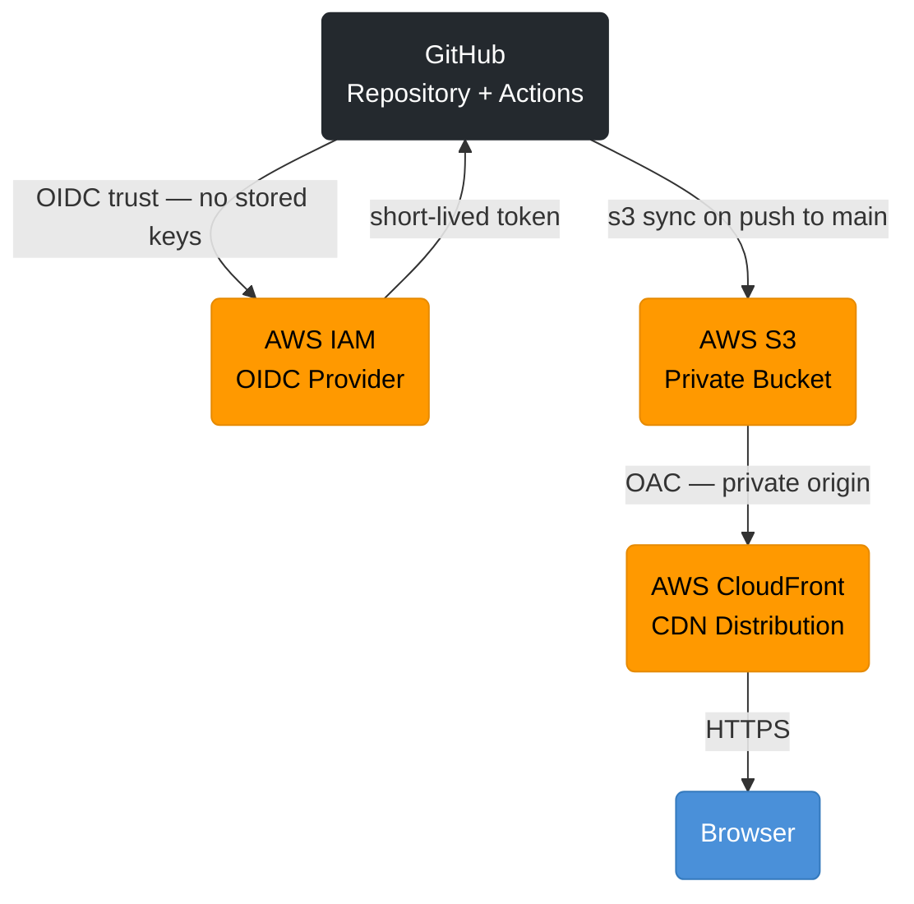
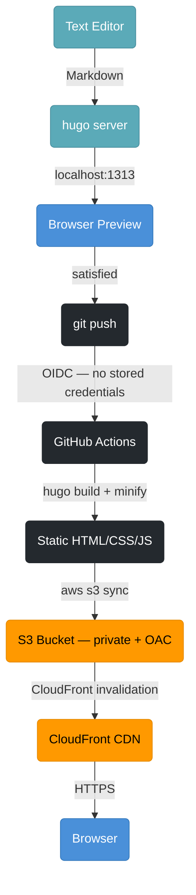

## Problem

I needed a way to display a portfolio of work that reflected where I am now —
not where I was when the old site was built. The previous site was WordPress on
shared hosting. It worked, but the friction involved in making even a simple
update was a barrier. Too many moving parts between "I have something to say"
and "it's live."

The solution needed to be Git-friendly, minimalistic, and fully operable from a
text editor and the command line.

It was also an opportunity to apply recent AWS learning and build skills in web development and deployment.

## Solution

A static site built with Hugo — a fast, Markdown-based site generator — deployed
automatically to AWS on every push to the main branch. The entire authoring
workflow is local: write in Obsidian or VS Code, preview in a browser, push when
satisfied. No CMS, no database, no admin panel.

## Architecture

## Content Deployment Workflow

## Monitoring

Availability monitoring via AWS CloudWatch Synthetics. A canary script runs every
5 minutes, checks `https://tacedata.ca` for HTTP 200, and triggers a CloudWatch
Alarm after 2 consecutive failures. The alarm publishes to SNS — an email alert
lands within 10 minutes of an outage. Cost: under $0.15/month.

[CloudWatch monitoring runbook](https://github.com/scottyleblanc/TACE.Website/blob/main/config/runbook-cloudwatch-monitoring.md)

## Tech Used

- Hugo Extended v0.158
- PaperMod theme
- Visual Studio Code
- Obsidian
- GitHub / GitHub Actions
- AWS S3 (private bucket, CloudFront OAC)
- AWS CloudFront
- AWS IAM (OIDC — short-lived tokens, no stored access keys)

## Runbooks

Step-by-step command references for each infrastructure stage, committed to the repository:

- [Stage 3 — AWS Infrastructure](https://github.com/scottyleblanc/TACE.Website/blob/main/config/runbook-stage3-aws.md) — S3, CloudFront, IAM, OIDC, GitHub Actions pipeline
- [Stage 5 — DNS Cutover](https://github.com/scottyleblanc/TACE.Website/blob/main/config/runbook-stage5-dns-cutover.md) — Route 53, ACM certificate, CloudFront domain attachment
- [CloudWatch Monitoring](https://github.com/scottyleblanc/TACE.Website/blob/main/config/runbook-cloudwatch-monitoring.md) — Synthetics canary, alarm, SNS alerting

## What I Learned

**Breaking a problem into logically sequenced stages makes it lighter.** The site
was built in stages — Hugo evaluation, email migration, AWS pipeline, content —
each one complete before the next began. That sequencing kept the work manageable.

**AWS is less expensive than I expected.** This site runs for under $2 USD/month.
S3 storage and CloudFront distribution costs are negligible at this scale.

**GitHub is more than a code repository.** GitHub Actions handles the entire
deployment pipeline. OIDC eliminates the need to store any AWS credentials —
GitHub and AWS establish trust directly, and tokens are short-lived.

**The hardest part is not the technical part.** The stack came together quickly.
The harder question — what do you want to present, and how do you communicate it
— is the part that takes longer.

## Links

- [GitHub Repository](https://github.com/scottyleblanc/TACE.Website)
